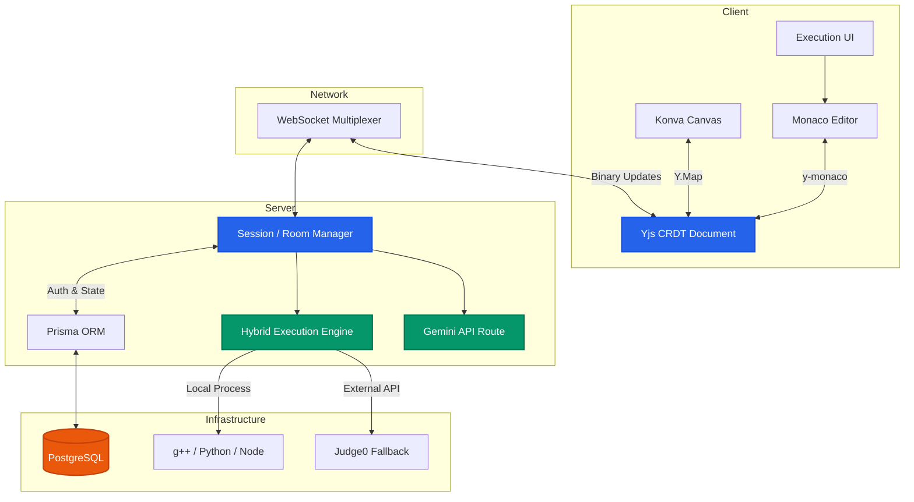
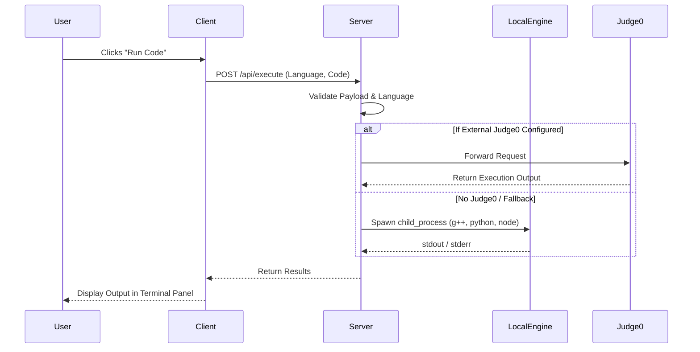

<div align="center">
  
  
  
  
  
  <br />
  <br />

  # ⚡ StreamSync

  **A Real-Time, AI-Powered Collaborative Workspace for Modern Engineering Teams**

  StreamSync is a fully-featured, multiplayer workspace combining live code collaboration, remote/local code execution, and an infinite canvas powered by state-of-the-art AI. Break down silos and build together, in real-time.

  [](https://reactjs.org/)
  [](https://nodejs.org/)
  [](https://www.typescriptlang.org/)
  [](https://yjs.dev/)
  [](https://deepmind.google/technologies/gemini/)

</div>

<hr />

## 🌟 The Core Innovation: Shared CRDT & Link Engine

The key insight in StreamSync's architecture is the **shared CRDT model layer**. Both the code buffer (`Y.Text`) and the infinite canvas graph (`Y.Map`) live inside a single Yjs document.

This architectural advantage enables the **Link Engine**:
- Canvas nodes can intuitively reference actual files in the workspace.
- Changes in the file tree automatically update related canvas nodes.
- Canvas interactions can seamlessly generate or modify files.
- Everything stays mathematically synchronized through the shared CRDT state, achieving perfect eventual consistency.

---

## 🏗️ Architecture & Data Flow

StreamSync utilizes a powerful Client-Server model that synchronizes Yjs CRDTs via a custom WebSocket multiplexer.



### Critical Concurrency Fixes Solved

1. **The Server JoinLock Race Condition:** To prevent clients from broadcasting updates before they are fully authorized, the server places a strict `JoinLock` during the database permissions check, enforcing sequential message processing and preventing dropped initialization packets.
2. **CRDT Offset Drift Mitigation:** Different operating systems use different newline characters (CRLF vs LF), which fundamentally breaks mathematical CRDT offsets over time. StreamSync injects a forceful `model.setEOL(0)` into Monaco, enforcing Unix line endings globally and maintaining perfect sync accuracy.

---

## ✨ Features & Capabilities

### 👨‍💻 Multiplayer Code Editor
Write code together in real-time with zero friction.
- Built on top of **Monaco Editor**.
- Uses **Yjs** for true conflict-free resolution and live cursors.

### 🏃‍♂️ Intelligent Code Execution Engine
Instantly run code directly from your browser with a robust **hybrid execution pipeline**:



### 🎨 Collaborative Infinite Canvas & 🤖 AI Integration
- **Infinite Canvas:** Powered by `Konva.js`. Synchronized perfectly for all connected peers.
- **AI Flowchart Generator:** Leverage the built-in **Gemini 2.5 Flash AI** to instantly analyze your workspace files and auto-generate complex architecture flowcharts directly onto your canvas.

### 🧩 Extensions Marketplace & 🔍 Global Workspace Search
- **Extensions Panel:** A built-in sidebar that simulates a marketplace, allowing users to discover and theoretically integrate new capabilities.
- **Global Search:** Regex-powered search across all workspace files with **Real-Time Line Reveal** (clicking a result scrolls the Monaco editor and flashes the exact line of code).

### 💎 Premium Design System
- Flexible CSS-variable-based design system with stunning premium themes like **Obsidian Gold** and **Nord Slate**.

---

## 📂 Project Structure

```text
📦 StreamSync
 ┣ 📂 client                  # Frontend App (Vite + React 19)
 ┃ ┣ 📂 src
 ┃ ┃ ┣ 📂 components          # React UI Components (Workspace, Sidebar, Editor)
 ┃ ┃ ┣ 📂 services            # Yjs & WebSocket connection managers
 ┃ ┃ ┣ 📂 store               # Zustand global state
 ┃ ┃ ┗ 📜 App.tsx             # Root Application
 ┃ ┗ 📜 package.json
 ┣ 📂 server                  # Backend API (Node.js + Express)
 ┃ ┣ 📂 src
 ┃ ┃ ┣ 📂 routes              # API Routes (Execute, AI, Auth, Rooms)
 ┃ ┃ ┣ 📂 websocket           # Yjs SocketHandler & RoomManager
 ┃ ┃ ┗ 📜 index.ts            # Server Entry Point
 ┃ ┣ 📂 prisma
 ┃ ┃ ┗ 📜 schema.prisma       # PostgreSQL Database Schema
 ┃ ┗ 📜 package.json
 ┗ 📜 README.md
```

---

## 🛠️ Technology Stack

| Layer | Technologies Used |
| :--- | :--- |
| **Frontend** | React 19, TypeScript, Tailwind CSS, Monaco Editor, Konva, Yjs, Zustand |
| **Backend** | Node.js, Express, WebSockets (`ws`), Prisma, bcryptjs, JWT |
| **Storage & DB** | PostgreSQL (via Prisma) |
| **Integrations** | Google Gemini 2.5 API, Judge0 API (Optional), GitHub OAuth |
| **Execution** | Node `child_process`, `g++`, `python3` |

---

## 🚀 Getting Started

### Prerequisites
- **Node.js** (v18+)
- **PostgreSQL Database** (e.g., Neon, Supabase, or local)
- **Local Compilers (Optional):** `python3` and `g++` (MinGW/GCC) installed in your PATH for local C/C++ execution.

### Installation

1. **Clone the repository**
   ```bash
   git clone https://github.com/ANSUJKMEHER/StreamSync.git
   cd StreamSync
   ```

2. **Setup Environment Variables**
   Create a `.env` file in the `server/` directory:
   ```env
   DATABASE_URL="your_postgresql_connection_string"
   JWT_SECRET="your_secure_jwt_secret"
   GEMINI_API_KEY="your_gemini_api_key"
   GITHUB_CLIENT_ID="your_github_oauth_client_id"
   GITHUB_CLIENT_SECRET="your_github_oauth_client_secret"
   
   # Optional: For external execution API
   RAPIDAPI_KEY="your_rapidapi_key"
   RAPIDAPI_HOST="judge0-ce.p.rapidapi.com"
   ```

3. **Install & Run (Unified Command)**
   From the **root** directory (`/StreamSync`), install dependencies and run both servers concurrently:
   ```bash
   npm run install:all
   npx prisma db push --schema=server/prisma/schema.prisma
   npm run dev
   ```

4. Navigate to `http://localhost:5173` in your browser.

---

## ☁️ Deployment

- **Frontend**: Optimized for [Vercel](https://vercel.com) or Netlify. Set `VITE_API_URL` to point to your backend.
- **Backend**: Deploy to [Render](https://render.com) or Heroku as a Node.js Web Service. Ensure the deployment environment has Python and GCC installed if utilizing the local execution engine.

---

## 🤝 Contributing
1. Fork the Project
2. Create your Feature Branch (`git checkout -b feature/AmazingFeature`)
3. Commit your Changes (`git commit -m 'Add some AmazingFeature'`)
4. Push to the Branch (`git push origin feature/AmazingFeature`)
5. Open a Pull Request

---
<div align="center">
  <i>Built with ❤️ for collaborative developers.</i>
</div>
